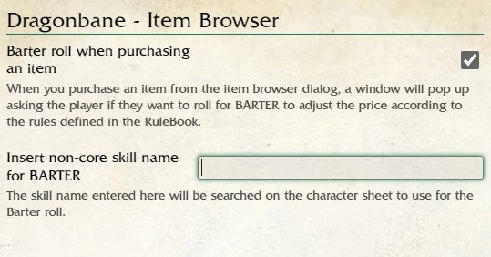
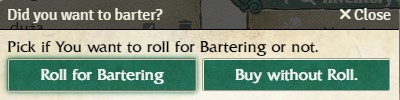
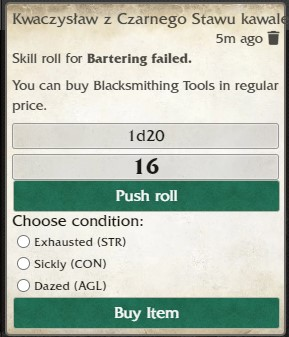

<h1>Dragonbane - Item Browser</h1>

This module allows you to easily add items to character sheets. It searches for all items in the game World (Compendiums are not searched) with the following types:

    <ul>
        <li>Item</li>
        <li>Armor</li>
        <li>Helmet</li>
        <li>Spell</li>
        <li>Ability</li>
    </ul>

<h2>Settings of the Module</h2>
In settings, you can toggle on the bartering option, like shown below:

    

If you use non-English skill names, please input the name of the used skill into the input window.

<h2>Using the Module</h2>

For those with supply elements, it will search for all items except those marked as "Unique." Ensure that all special items, such as adventure-specific meaningful items, have "Unique" set as the supply type.

The module also works with localization (using a language other than English) as long as you use the exact same names for gold, silver, and copper as those shown in the Inventory tab under the coin section. You don’t need to worry about capital letters.

In the tabs for Heroic Abilities, Magic Tricks, Spells, Equipped Weapons, Equipped Armor, Equipped Helmets, and Items, you will find a magnifying glass icon.

    
    

Clicking on it opens a browser dialog for the selected type, based on where you clicked. It will look like this:

    

By hovering over an item name, you will see its description:

    

Clicking on an item name opens the item sheet.

If an item has a price, a coin icon will appear next to it. Clicking the icon will add the item to the character sheet for which the Item Browser was opened. This works only if the character can afford the item or if the price needs to be determined by the GM (e.g., for poison).

In cases where the price is determined through rolling, it will be calculated automatically. The result of the roll defines the price, which will be subtracted from available coins. Examples are shown below:

    
    

For spells and abilities, clicking the plus icon will add them to the character sheet and display a message in the chat.

    

<h2>Rolling for Barter</h2>

If you turn on the bartering option in the settings, after clicking the coin in the item browser, you will see a dialog window with an option to buy the item with or without rolling.

    

If you choose to roll, the standard skill roll dialog will appear.

After rolling, you will find a "Buy Item" button in the chat, allowing you to buy the chosen item at the price defined in the Core Rulebook on page 33.

The chat message will look like this for a failed roll:

    

And for a successful roll:

    

After clicking the "Buy Item" button, the proper price will be subtracted from the character's coins if possible.

    

<h1>Dragonbane - Przeglądarka Przedmiotów</h1>

Ten moduł pozwala na łatwe dodawanie przedmiotów do kart postaci. Wyszukuje wszystkie przedmioty w świecie gry (Kompendia nie są przeszukiwane) o następujących typach:

    <ul>
        <li>Przedmiot</li>
        <li>Zbroja</li>
        <li>Hełm</li>
        <li>Czar</li>
        <li>Zdolność</li>
    </ul>

<h2>Ustawienia Modułu</h2>
W ustawieniach możesz włączyć opcję targowania, jak pokazano poniżej:

    

Jeśli używasz nazw umiejętności w innym języku niż angielski, wpisz nazwę używanej umiejętności w oknie wejściowym.

<h2>Korzystanie z Modułu</h2>

Dla tych z elementami dostępności, moduł wyszukuje wszystkie przedmioty z wyjątkiem tych oznaczonych jako "Rzadkie". Upewnij się, że wszystkie specjalne przedmioty, takie jak przedmioty znaczące dla przygody, mają ustawiony typ dostępności na „Rzadka”.

Moduł działa również z lokalizacją (tłumaczeniem na język inny niż angielski), o ile używasz dokładnie tych samych nazw dla złota, srebra i miedzi, które znajdują się w zakładce Ekwipunek w sekcji monet. Nie musisz martwić się o wielkość liter.

W zakładkach Zdolności Heroicznych, Magicznych Sztuczek, Czarów, Wyposażonej Broni, Wyposażonej Zbroi, Wyposażonych Hełmów i Przedmiotów znajdziesz ikonę lupy.

    
    

Kliknięcie jej otworzy okno przeglądarki dla wybranego typu, w zależności od miejsca, w którym kliknięto. Wygląda to tak:

    

Najechanie na nazwę przedmiotu spowoduje wyświetlenie jego opisu:

    

Kliknięcie nazwy przedmiotu otworzy jego kartę.

Jeśli przedmiot ma cenę, obok niego pojawi się ikona monety. Kliknięcie tej ikony doda przedmiot do karty postaci, dla której otwarto Przeglądarkę Przedmiotów. Działa to tylko wtedy, gdy postać może sobie pozwolić na zakup przedmiotu lub gdy cena musi zostać określona przez OM (osobę mistrzującą) (np. w przypadku trucizn).

W przypadkach, gdy cena jest określana przez rzut kością, zostanie ona obliczona automatycznie, a wynik rzutu określi cenę, która zostanie odjęta z dostępnych monet. Przykłady pokazano poniżej:

    
    

W przypadku czarów i zdolności kliknięcie ikony plusa doda je do karty postaci i wyświetli wiadomość na czacie.

    

<h2>Targowanie (Barter)</h2>

Jeśli włączysz opcję targowania w ustawieniach, po kliknięciu monety w przeglądarce przedmiotów pojawi się okno dialogowe z opcją zakupu przedmiotu z rzutem lub bez rzutu.

    

Jeśli wybierzesz rzut, pojawi się standardowe okno dialogowe rzutu umiejętności.

Po rzucie w czacie znajdziesz przycisk "Kup przedmiot", który pozwoli ci kupić wybrany przedmiot w cenie określonej na stronie 33 w Podręczniku Podstawowym.

Wiadomość na czacie będzie wyglądać tak w przypadku nieudanego rzutu:

    

I tak w przypadku udanego rzutu:

    

Po kliknięciu przycisku "Kup przedmiot" odpowiednia cena zostanie odjęta z monet postaci, jeśli jest to możliwe.

    

